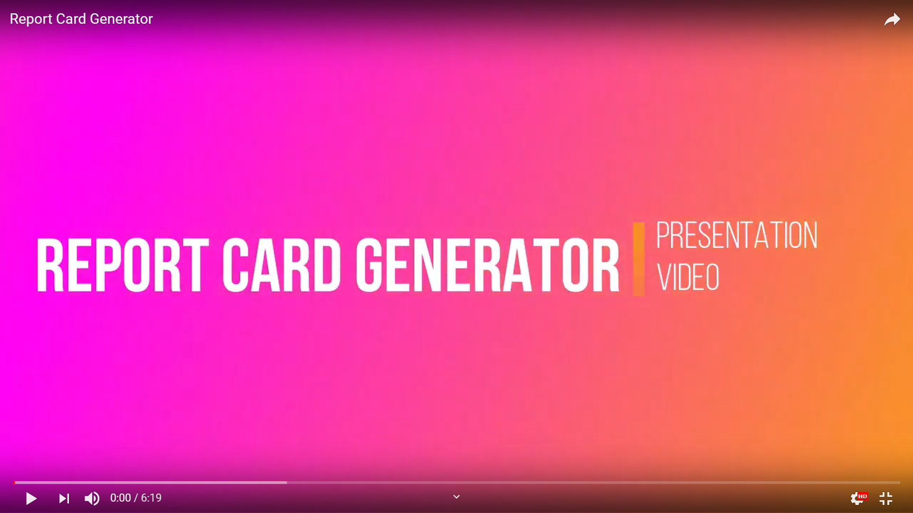

# Report-Card-Generator
## Description:
This is an automated system that can analyse student performance,generate reports and automatically send it to the students.
The main objective of this project is to analyze the performance and convert it into a report format and we have to build that report in such a manner that it's trigger point should be a preset date.
This has three sections
1.Analysing Part
2.pdf generator
3.Email

list of libraries ( we have used):
1. [pandas](https://en.wikipedia.org/wiki/Pandas_(software))
2. [numpy](https://en.wikipedia.org/wiki/NumPy)
3. [openpyxl](https://stackoverflow.com/tags/openpyxl/info)
4. [requests](https://en.wikipedia.org/wiki/Requests_(software))
5. [seaborn](https://en.wikipedia.org/wiki/Seaborn)
6. [matplotlib](https://en.wikipedia.org/wiki/Matplotlib)
7. [difflib](https://docs.python.org/3/library/difflib.html)
8. [smtplib](https://docs.python.org/3/library/smtplib.html)
9. [encoders](https://github.com/threat9/routersploit/wiki/Encoders)
10. [Template](https://www.geeksforgeeks.org/template-class-in-python/)
11. [canvas](https://www.python-course.eu/tkinter_canvas.php)
12. [A4](https://stackoverflow.com/questions/15571267/python-a4-size-for-a-plot)

## Table of Contents
1.Team members
2.Project Demo

#### Team Members
"Sushree Siddhishikha"siddhishikha1998@gmail.com

"Shakib Mondal"sakibmondal7@gmail.com

"Dipam Hazra"dipamhazra1999@gmail.com

#### Project Demo
We have created a small video related to our project.You will get some brief idea about this.

## Quick get Git
#### 1.Clone the repository and checkout a new branch.

$ git clone https://github.com/SkeyRahaman/Report-Card-Generator
#### 2.Update the files you'd like to change
#### 3.Push the changes upstream
#### 4.View your branch in Github and create a Pull Request

## Display of Coding part

[code](https://github.com/SkeyRahaman/Report-Card-Generator/blob/master/Report_card_generator.py)

There you can find and get the information of the system(project) of rules. There are comment which helps a programmer-readable explanation or annotation in this code.

## Requirements
[Required Things](https://github.com/SkeyRahaman/Report-Card-Generator/tree/master/photos_and_other_requirement)

In the above link you can find the photos of the students  and some required documents which are used in the analysis and building of this project.
